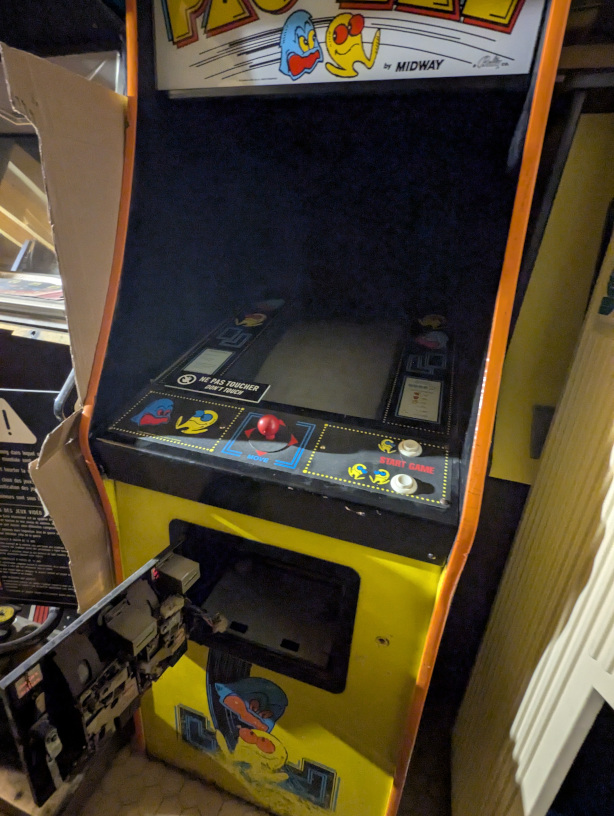
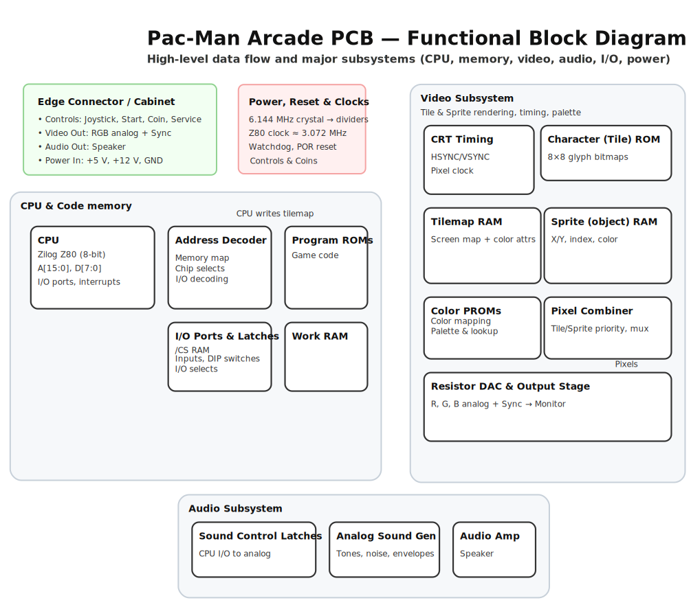
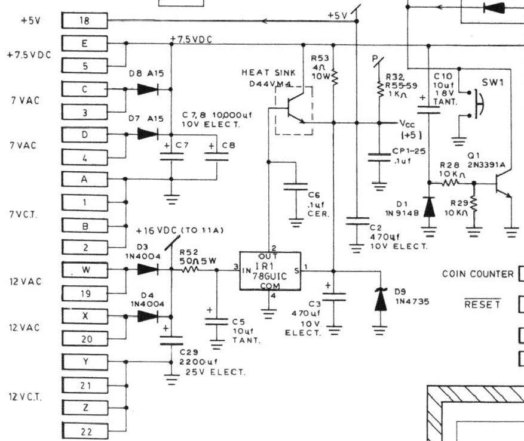
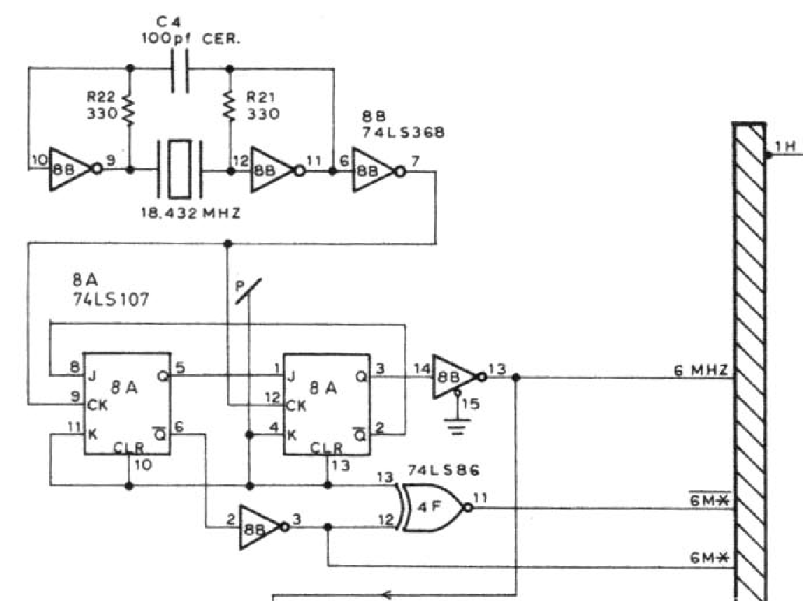
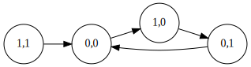
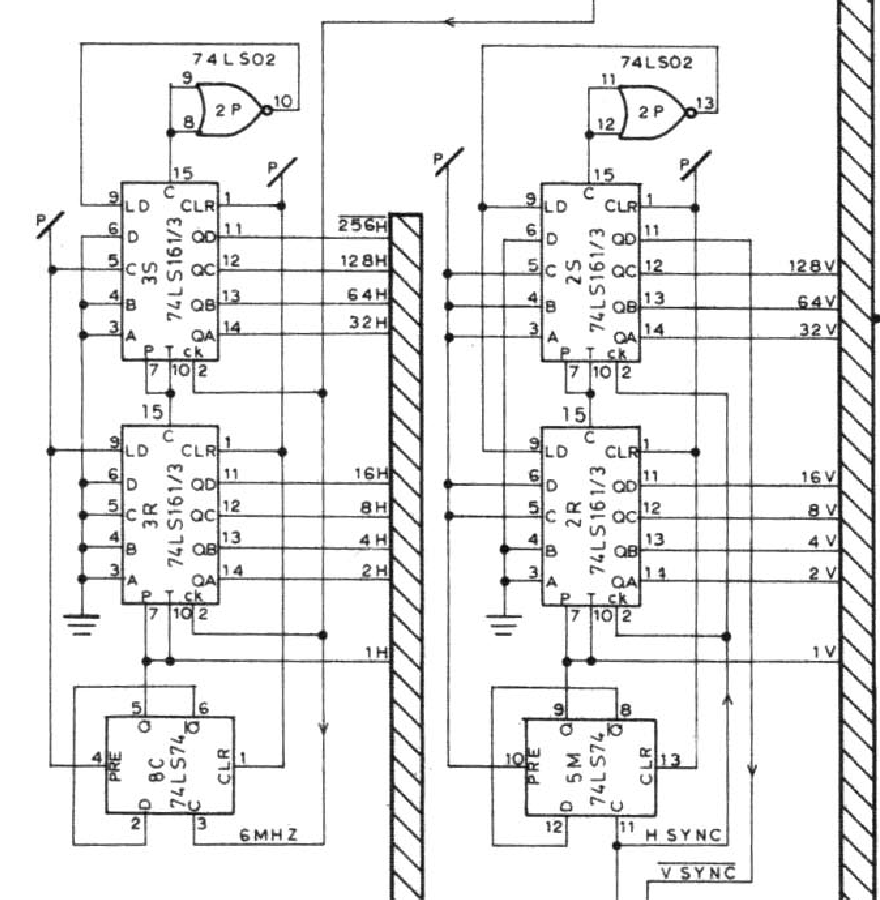

# Pacman hardware documentation

This documnent is a description of the Pacman arcade game's hardware, reversed-engineered from the schematic.
Although much information about the software do exist, as far as I know there isn't a comprehensive guide to explain how its hardware works in detail. You can [get the full schematic here](assets/pacman_logic_board_b_schematic.jpg), thanks to user GaryMcT from the forum at [Arcade Museum](arcade-museum.com).

Pacman (or Pac Man, Pac-man, パックマン, Pakku Man, Puckman, ...)  is certainly one of the most iconic videogames in history, and thus it deserves to be well documented and understood in detail.

I'm completing this guide in my spare time, but please make a Pull Request in Github if you'd like to contribute!

# Functional diagram

# Power

Pacman takes several AC and DC input voltages at the edge corrector: 5 DC, 7.5 VCD, 7 VAC, 7 VCT, 12 VAC, and 12 VCT.

The notation in the schematic refers to:

* VDC: voltage direct current (DC)
* VAC: voltage alternating current (AC)
* VCT: the central tap of the transformer, usually used as a ground reference

The 5 V DC voltage is taken directly from the edge connector pin 18, and it's used to power most of the TTL chips in the board. Capacitor C2 filters out low frequencies and capacitor CP1-25 the high-frequencies.

Pins C, 3, D, and 4 take 7 VAC, which is rectified with diodes D7 and D8 to obtain a positive (but semi-sinusoidal) signal, which charges capacitors C7 and C8 to obtain 7 V DC. On pins E and 5, it can receive directly 7.5 V DC. In the schematic both the generated 7 V DC and the 7.5 V DC input are connected together, suggesting the board can choose between a DC or AC input, as an option.

Pins 1, B, and 2 are the center tap of the transformer, referenced to ground. Pins 21, Z, and 22 are 12 VCT, also referenced to ground.

Pins W, 19, X, and 20 take 12 V AC as input. This signal is rectified with diodes D3 and D4, and stabilied with capacitor C29. The schematic indicates that after the diodes there'a 16 VCD voltage, although if the input voltage is 12 V AC, one would expect about 12 - 0.6 = 11.4 V DC, not 16 VDC. In any case, this is not importante since this tension is to power up the audio amplified at 11A, but it can work within voltages between 6 and 24 V. These 16 or 12 VDC are the input of the IR1 chip (78GU1C), a voltage regulator.

IR1 is designed to output 5V DC at its output sense pin 1. It increases or decreases the current through BJT D44VM4 with its output pin 2. The role of resistor R53 is to share the load's current with the BJT,  [probably to avoid requiring a larger heatsink](https://electronics.stackexchange.com/questions/458315/can-someone-explain-the-purpose-of-r53-in-this-old-linear-power-supply-circuit). The zener diode D9 is a protection to limit to 6.2 V the voltage in the 5 V rail.

# Timing

## The 6 MHz master clock
The clock is generated by a series resonant circuit oscillator using a 18.432 MHz quartz crystal.
The oscillating signal the input of pin 6 of the 74LS368 buffer (chip 8B), which saturates it to convert it into a square clock signal. This digital 18.432 MHz square signal is then divided by 3 to obtain a 6.14 Mhz master clock. The division is performed by the two JK flip flops in 8A (74LS107).

Let's call A the flip flop in the left, and B the one on the right.

A good way to analyze this circuit is to consider its current state (QA, QB) and to see how it transitions to the next states. We can make a table with (QA, QB), the values of JA and JB, and the next state (QAn, QBn):

|QA|QB|JA|JB|QAn|QBn|
|-|-|-|-|-|-|
|0|0|1|0|1|0|
|0|1|0|0|0|0|
|1|0|1|1|0|1|
|1|1|0|1|0|0|

And as directed graph:

The last bit is our master clock signal.
Following the states, we can see that the cycle is (0,0) &rarr; (1,0) &rarr; (0,1). And back to (0,0) again.
The output is thus 0, 0, 1, and therefore the input frequency is divided by three.

The oscillator produces a square signal of 18.432 MHz, so the master clock ends up with a frequency of 6.144 MHz. In the schematic it's approximated as 6 Mhz.

## Clock divisions
The 6 MHz clock signal is decomposed in a series of horizonal (H) and vertical (V) divisions, using for each the same structure made by a frequency dividir with a D flip flop (74LS74) and two counters (74LS161). For the H divisions the input is the 6 MHz clock signal, whereas for the V divisions it's the HSYNC signal.

The 6 MHz clock signal is fed into the D flip flop at 8C, which has its output connected to its input. Therefore, it halves the input frequency, producing the first 1H output. The rest of divisions are obtained with the binary counters 3R and 3S.

Each Hi has a frequency of (6 / i) MHz. 3R is fed with 1H, and it produces 2H (3 MHz), 4H (1.5 1MHz), 8H (750 KHz) and 16H (375 KHz).
Then the counter at 3S keeps counting, fed by the carry bit of 3R, and produces 32H (187.5 KHz), 64H (93.8 KHz), 128H (46.9 KHz), and 256H (23.4 KHz).

## Horizontal and vertical sync
ToDo...

# Some references
Here you are some references to pages and documents with relevant information.

* [Pac-man trouble shooting logic board, part I](https://www.arcade-museum.com/manuals-videogames/P/Pacman-Troubleshooting-Guide-Part1.pdf)

* [Pacman and Ms Pacman Trouble Shooting Guide Part 2](https://www.arcade-museum.com/manuals-videogames/P/Pacman-Mspacman-Troubleshooting-Guide-Part2.pdf)
 
* [Pac-man Repair & Troubleshooting Guide](https://lawnmowerman.rotheblog.com)

* [Pac-Man Dip Switch Settings | Settings for The Pac-Man Arcade](https://classicgaming.cc/classics/pac-man/tech-dip-switch-settings)

* [Pac-man board problems and fixes](https://www.mikesarcade.com/arcade/pacfix.html)

* [Troubleshoot your Pacman / Ms Pacman board by picture.
103 photos of problems and solutions.](https://www.mikesarcade.com/arcade/pactrouble.html)

* [Pacman hardware](https://walkofmind.com/programming/pie/hardware.htm)

* [Pac-Man Memory Layout | Settings for The Pac-Man Arcade](https://classicgaming.cc/classics/pac-man/tech-memory-layout)

* [PacMan Memory-Map](www.euro-arcade.de/files/pacman_mm/pacman_mm.htm)

