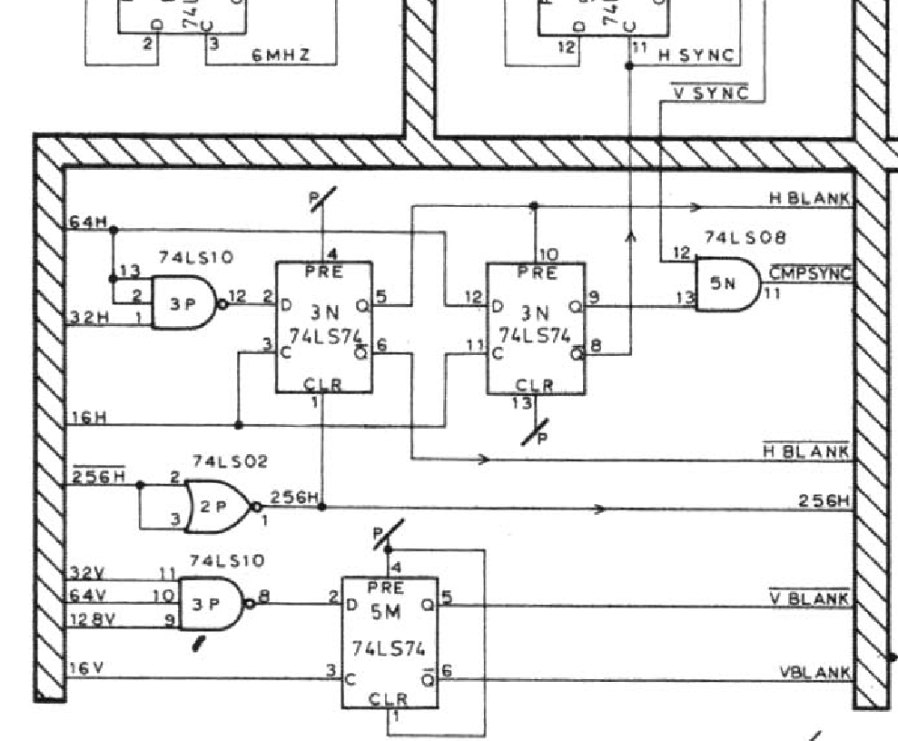
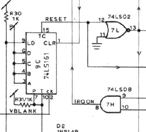
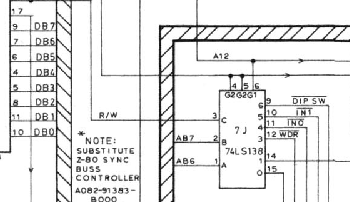
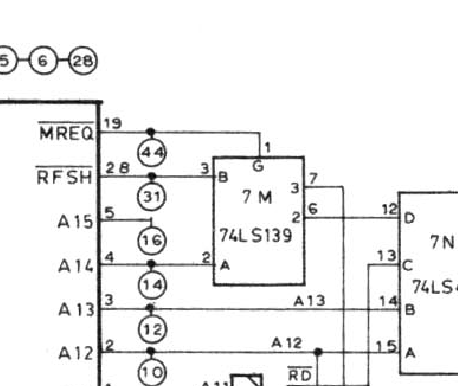
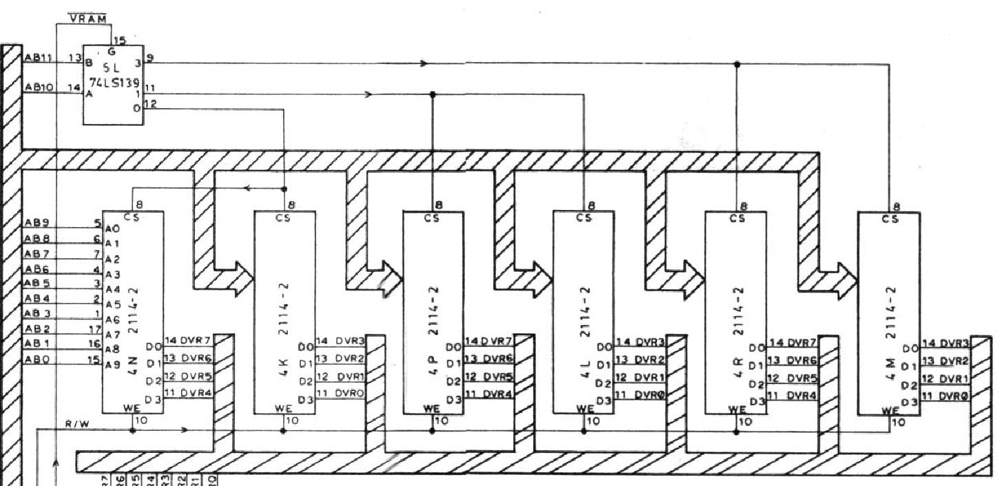
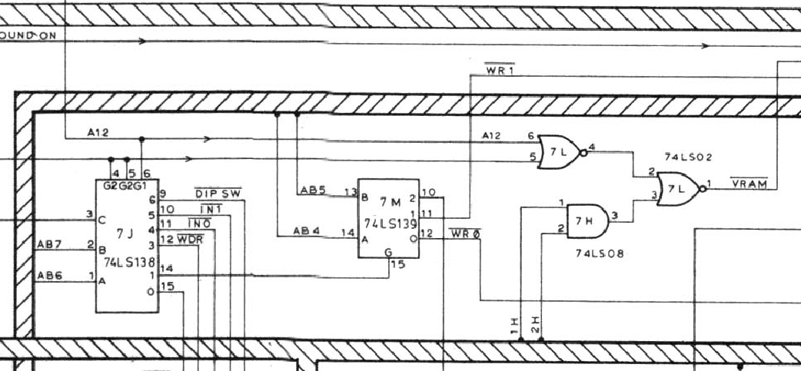
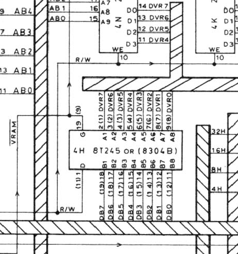
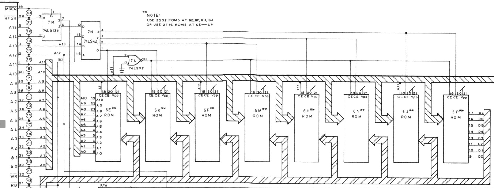
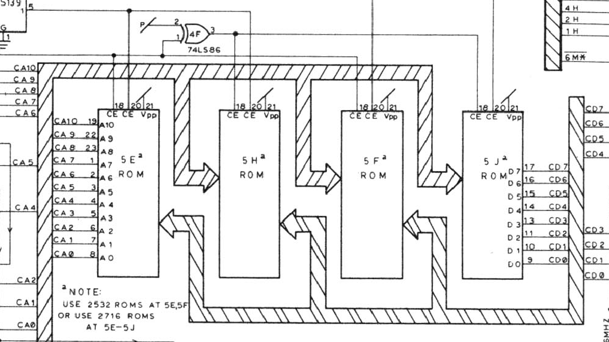

# Pacman hardware documentation

This documnent is a description of the Pacman arcade game's hardware, reversed-engineered from the schematic.
Although much information about the software do exist, as far as I know there isn't a comprehensive guide to explain how its hardware works in detail. You can [get the full schematic here](assets/pacman_logic_board_b_schematic.jpg), thanks to user GaryMcT from the forum at [Arcade Museum](arcade-museum.com).

Pacman (or Pac Man, Pac-man, パックマン, Pakku Man, Puckman, ...)  is certainly one of the most iconic videogames in history, and thus it deserves to be well documented and understood in detail.

I'm completing this guide in my spare time, but please make a Pull Request in Github if you'd like to contribute!

# Functional diagram

# Power

Pacman takes several AC and DC input voltages at the edge corrector: 5 DC, 7.5 VCD, 7 VAC, 7 VCT, 12 VAC, and 12 VCT.

The notation in the schematic refers to:

* VDC: voltage direct current (DC)
* VAC: voltage alternating current (AC)
* VCT: the central tap of the transformer, usually used as a ground reference

The 5 V DC voltage is taken directly from the edge connector pin 18, and it's used to power most of the TTL chips in the board. Capacitor C2 filters out low frequencies and capacitor CP1-25 the high-frequencies.

Pins C, 3, D, and 4 take 7 VAC, which is rectified with diodes D7 and D8 to obtain a positive (but semi-sinusoidal) signal, which charges capacitors C7 and C8 to obtain 7 V DC. On pins E and 5, it can receive directly 7.5 V DC. In the schematic both the generated 7 V DC and the 7.5 V DC input are connected together, suggesting the board can choose between a DC or AC input, as an option.

Pins 1, B, and 2 are the center tap of the transformer, referenced to ground. Pins 21, Z, and 22 are 12 VCT, also referenced to ground.

Pins W, 19, X, and 20 take 12 V AC as input. This signal is rectified with diodes D3 and D4, and stabilied with capacitor C29. The schematic indicates that after the diodes there'a 16 VCD voltage, although if the input voltage is 12 V AC, one would expect about 12 - 0.6 = 11.4 V DC, not 16 VDC. In any case, this is not importante since this tension is to power up the audio amplified at 11A, but it can work within voltages between 6 and 24 V. These 16 or 12 VDC are the input of the IR1 chip (78GU1C), a voltage regulator.

IR1 is designed to output 5V DC at its output sense pin 1. It increases or decreases the current through BJT D44VM4 with its output pin 2. The role of resistor R53 is to share the load's current with the BJT,  [probably to avoid requiring a larger heatsink](https://electronics.stackexchange.com/questions/458315/can-someone-explain-the-purpose-of-r53-in-this-old-linear-power-supply-circuit). The zener diode D9 is a protection to limit to 6.2 V the voltage in the 5 V rail.

# Timing

## The 6 MHz master clock
The clock is generated by a series resonant circuit oscillator using a 18.432 MHz quartz crystal.
The oscillating signal the input of pin 6 of the 74LS368 buffer (chip 8B), which saturates it to convert it into a square clock signal. This digital 18.432 MHz square signal is then divided by 3 to obtain a 6.14 Mhz master clock. The division is performed by the two JK flip flops in 8A (74LS107).

Let's call A the flip flop in the left, and B the one on the right.

A good way to analyze this circuit is to consider its current state (QA, QB) and to see how it transitions to the next states. We can make a table with (QA, QB), the values of JA and JB, and the next state (QAn, QBn):

|QA|QB|JA|JB|QAn|QBn|
|-|-|-|-|-|-|
|0|0|1|0|1|0|
|0|1|0|0|0|0|
|1|0|1|1|0|1|
|1|1|0|1|0|0|

And as a directed graph:

The last bit is our master clock signal.
Following the states, we can see that the cycle is (0,0) &rarr; (1,0) &rarr; (0,1). And back to (0,0) again.
The output is thus 0, 0, 1, and therefore the input frequency is divided by three.

The oscillator produces a square signal of 18.432 MHz, so the master clock ends up with a frequency of 6.144 MHz. In the schematic it's approximated as 6 Mhz.

## Clock divisions
The 6 MHz clock signal is decomposed in a series of horizonal (H) and vertical (V) divisions, using for each the same structure made by a frequency dividir with a D flip flop (74LS74) and two counters (74LS161). For the H divisions the input is the 6 MHz clock signal, whereas for the V divisions it's the HSYNC signal.

The 6 MHz clock signal is fed into the D flip flop at 8C, which has its output connected to its input. Therefore, it halves the input frequency, producing the first 1H output. The rest of divisions are obtained with the binary counters 3R and 3S.

To simplify the notation, let's consider that our working clock is half of the master clock, that is 3 MHz.
Then, the notation iH means dividing the frequency of the working clock by i. 1H is dividing by 1, so it's 3 MHz, 2H is 1.5 MHz, 4H is 0.75 MHz, and so on. The counter at 3S, fed by the carry bit of 3R, produces 32H (93.8 KHz), 64H (46.9 KHz), 128H (23.4 KHz), and 256H (11.7 KHz). 1H is one cycle of the working clock.

## Horizontal and vertical sync

Two important signals for the video generation are obtained from the frequency divisions: the horizontal blanking (H BLANK), the vertical blanking (V BLANK), and the composite sync (CMPSYNC).

H BLANK is generated using the D flip flop at 3N. Its D input is H whenever H64=L or H32=L. This takes 64+32=96 cycles of the working clock, after 256H activates. Given that each cycle takes 1/3 us, the H BLANK cycle will be 96/3 = 32 us. Since we're only interested in half of the cycle (the time it stays H), finally we have that H BLANK is 32/2 = 16 us, aprox. If we'd need to exact timing, we should consider the exact frequency of the master clock: 96 / (18.432 / 3) = 15.625 us.

**[ToDo]: document also V BLANK, CMPSYNC, V SYNC, AND H SYNC.**

<!--
To obtain H SYNC, 64H is sampled at 16H with flip flip D at 3N. Thus, it'll take 64 cycles to activate (10.42 us), and it'll be active for 16 cycles (2.60 us).

The vertical divisions work the same way as the horizontals. The clock of 5M is fed with H SYNC (64H). V SYNC is obtained by dividing H SYNC by 256, giving total of 64*256 = 16384 H1 cycles = 16384 / 3 us = 5461.33 us.

H BLANK 96 H1 cycles (PRE)
D 64H is 63/3 us = 21.33 us ; * 256 = 5461.33 us = 183 Hz

H SYNC
Dura a H 16H  gives  5.33 us
Entrada a 64H gives 21.33 us = 42.86 KHz (OK)

64H * 256 = 16384 us gives 61.035 Hz

In [47]: 1/16384e-6
Out[47]: 61.03515625

In [8]: (1/5461.33e-6) /3
Out[8]: 61.03519350292572

In [45]: (1/(64*256e-6))
Out[45]: 61.03515625

5.33 us * 256 = 1364.48 us = 0.00074 MHz = 0.73 Khz = 732.8799249530957 Hz

https://forums.arcade-museum.com/threads/what-do-pac-man-sync-signals-look-like.545345/

Hsync is 6MHz / (256+128) = 15625kHz
HBlank pulse width = 96 / 6MHz = 16us, starting 16 / 6MHz = 2.67us after 256H goes high.
HSync pulse width = 32 / 6MHz = 5.33us at the end of HBlank

etc...

=================

entrada = (64/3)*1e-6
entrada_mult = entrada * 16

-->

## Watchdog timer
To prevent that the game gets accidentally frozen because of any potential bugs, Pacman has a watchdog timer that resets the system if the code is not constantly writing to the address 0x50C0.

The reset signal originates at the counter 9C, clocked with VBLANK.

When it reaches value 15, it will activate TC, which will produce the RESET signal. This can be prevented if the counter is cleared

The asynchronous clear for the counter comes from signal /WDR of decoder 7J. /WDR activates when R/W=L (a write) and AB7=AB6=H.
Also, to be active the decoder needs G1=A12=H, as well a signal G2 from the custom IC 6D.

So far, this gives this address:

|AB15|AB14|AB13|AB12|AB11|AB10|AB9|AB8|AB7|AB6|AB5|AB4|AB3|AB2|AB1|AB0|
|-|-|-|-|-|-|-|-|-|-|-|-|-|-|-|-|
|.|.|.|1|.|.|.|.|1|1|.|.|.|.|.|.|

However, we know that the watchdog address is 0x50C0, which is

|AB15|AB14|AB13|AB12|AB11|AB10|AB9|AB8|AB7|AB6|AB5|AB4|AB3|AB2|AB1|AB0|
|-|-|-|-|-|-|-|-|-|-|-|-|-|-|-|-|
|0|1|0|1|0|0|0|0|1|1|0|0|0|0|0|0|

This means that we also need that AB14 is active. This address line goes to decoder 7M, which takes get enabled with /MREQ and selects with (AB14, /RFSH). The output activates low when AB14=/RFSH=H. Its output goes to custom IC 286 at its pin 27, which takes it in pin 27 as a /CS signal. When /CS is active, it'll generate a clock signal in its pin 12, thus activating 7J.

To summarize, any write to memory address x1x1xxxx11xxxxxx (including 0101000011000000 = 0x50C0) will be noticed by the watchdog and prevent the machine from resetting.

# Buses
The system has different buses, depending on the type of data they transport.

* **VH bus**: it contains the horizontal (H1, H2, H4, ...) and vertical divisions (V1, V2, V4, ...) of the working clock.
* **DB bus**: it contains user inputs (activated with the signals /IN0 and /IN1), the DIP switches settings (activated with signal /DIPSW), the Z80 program data, and the VRAM data from chips 4N-4M
* **AB bus**: it contains the addresses AB0, ..., AB11. They shared along most of the components of the system, given that  the access to the different devices is memory mapped.

# Video RAM
The video RAM (VRAM) is made by 6 chips: 4N, 4K, 4P, 4L, 4R, and 4M.
In general, in the bus only the address bit A11, ..., A0 are present.  The other bits A14, A13, and A12 are used to activate or inhibit different parts of the hardware. A15 is not used whatsoever.

They are activated with their CS signal, which comes from the decoder 5L. In order to get activated, the decoder has to have /VRAM = L.

The /VRAM signal is generated by logic of NOR and AND gates at 7L and 7H.

To have /VRAM=L we need A12=H and that that custom chip 6D has its /CS line active, that happens when A14=H in decoder 7M.

|AB15|AB14|AB13|AB12|AB11|AB10|AB9|AB8|AB7|AB6|AB5|AB4|AB3|AB2|AB1|AB0|
|-|-|-|-|-|-|-|-|-|-|-|-|-|-|-|-|
|.|1|.|0|0|0|.|.|.|.|.|.|.|.|.|.|

AB15 is unused and we don't care about AB13, so we can set them to zero to define our VRAM address range, without mirroring:

|AB15|AB14|AB13|AB12|AB11|AB10|AB9|AB8|AB7|AB6|AB5|AB4|AB3|AB2|AB1|AB0|
|-|-|-|-|-|-|-|-|-|-|-|-|-|-|-|-|
|0|1|0|0|x|x|x|x|x|x|x|x|x|x|x|x|

Therefore, the first VRAM address is 0100000000000000 = 0x4000...

|AB15|AB14|AB13|AB12|AB11|AB10|AB9|AB8|AB7|AB6|AB5|AB4|AB3|AB2|AB1|AB0|
|-|-|-|-|-|-|-|-|-|-|-|-|-|-|-|-|
|0|1|0|0|0|0|0|0|0|0|0|0|0|0|0|0|

...and the last one is 0x4FFF:

|AB15|AB14|AB13|AB12|AB11|AB10|AB9|AB8|AB7|AB6|AB5|AB4|AB3|AB2|AB1|AB0|
|-|-|-|-|-|-|-|-|-|-|-|-|-|-|-|-|
|0|1|0|0|1|1|1|1|1|1|1|1|1|1|1|1|

The actual addresses and contents of each ROM are given in the following table.

|Address range|IC|Function|
|-|-|-|
|4000-43FF|4P|Tile number|
|4400-47FF|4N|Tile color|
|4800-4FBF|4R, 4S|Z80 scratchpad|
|4FC0-4FEF|4R, 4S|Z80 stack|
|4FF0-4FFF|4K|Sprite attributes|

The sprite attributes area has 8 entries, which are the X, Y, tile, color, and flip attributes of the sprite.

The movement of data from and to the bus it mediated by the transceiver at 4H. 

The R/W signal controls the direction (read from the VRAM to the bus, or write to the VRAM from the bus). It's activated according to the /VRAM signal.

# ROMs
Pacman is made of several ROMs.

* There's one set 6E, 6K, 6F, 6M, 6H, 6N, 6J, and 6P at the top of the schematic
* Four ROMs 5E, 5H, 5F, and 5J below
* PROMs 1M, 3M, 4A, and 7F

The board admits using 2732 ROMs (for example, at 5E and 5F), or pairs of two 2716 chips (as in 5E, 5H, 5F, and 5J).

The PROMs are:

|Position|Function|
|-|-|
|1M|Audio|
|3M|Audio|
||||
|4A|Color code|
|7F|Color palette|

## Z80 code EPROMS
The ROMs on the top of the schematic contain the main Z80 code of the game, in these adddresses:

|Position|Function|
|-|-|
|6K|Z80 code, 0x0000–0x07FF|
|6E|Z80 code, 0x0800–0x0FFF|
|||
|6M|Z80 code, 0x1000–0x17FF|
|6F|Z80 code, 0x1800–0x1FFF|
|||
|6N|Z80 code, 0x2000–0x27FF|
|6H|Z80 code, 0x2800–0x2FFF|
|||
|6P|Z80 code, 0x3000–0x37FF|
|6J|Z80 code, 0x3800–0x3FFF|

The board can admits 4 Kb 2732 ROMs at 6E, 6F, 6H and 6J, or divide each 2716 into two 2 Kb 2716 chips.

In this section we'll assume that the board is using eight 2732 chips, as shown in the schematic.

The have to CE signals. Let's focus first on the one at pin 18. It takes line address A11 in half of the chips, and /A11 in the other half. This is because it's splitting each of the 2732 ROMs into two 2716, and it uses address line A11 for the division. When A11=1, it'll chose 6E, 6F, 6H, and 6J. When A11=0, it'll choose 6K, 6M, 6N, and 6P. The NOR gate at 7L simply acts as an inverter for A11 to obtain /A11.

The second CE signal comes from the decimal decoder 7N. It´ ll activate one pair of ROM chips at a time: (6E, 6K), (6F, 6M), (6H, 6N), or (6J, 6P).
Which pair the decoder activates depends on:

* Address lines A12 and A13
* the /RD signal
* the output pin 6 of the decoder at 7M

The decoder 7M will activate its output at pin 6 when /RFSH=H and A14=L.

Let's see now under which other conditions each of the ROM pairs activates, and which is the associated address range.

* **6E, 6K**: we need that the decoder 7N activates its 0, which happens with A14=0, /RD=0, A13=0, A12=0

|AB13|AB12|AB11|AB10|AB9|AB8|AB7|AB6|AB5|AB4|AB3|AB2|AB1|AB0|
|-|-|-|-|-|-|-|-|-|-|-|-|-|-|
|0|0|x|x|x|x|x|x|x|x|x|x|x|x|

From 0x0000 to 0x0FFF.

* **6F, 6M**: we need that the decoder 7N activates its output 1, which happens when A14=0, /RD=0, A13=0, A12=1

|AB13|AB12|AB11|AB10|AB9|AB8|AB7|AB6|AB5|AB4|AB3|AB2|AB1|AB0|
|-|-|-|-|-|-|-|-|-|-|-|-|-|-|
|0|1|x|x|x|x|x|x|x|x|x|x|x|x|

From 0x1000 to 0x1FFF.

* **6H, 6N**: we need that the decoder 7N activates its output 2, which happens when A14=0, /RD=0, A13=1, A12=0

|AB13|AB12|AB11|AB10|AB9|AB8|AB7|AB6|AB5|AB4|AB3|AB2|AB1|AB0|
|-|-|-|-|-|-|-|-|-|-|-|-|-|-|
|1|0|x|x|x|x|x|x|x|x|x|x|x|x|

From 0x2000 to 0x2FFF.

* **6J, 6P**: we need that the decoder 7N activates its output 3, which happens when A14=0, /RD=0, A13=1, A12=1

|AB13|AB12|AB11|AB10|AB9|AB8|AB7|AB6|AB5|AB4|AB3|AB2|AB1|AB0|
|-|-|-|-|-|-|-|-|-|-|-|-|-|-|
|1|1|x|x|x|x|x|x|x|x|x|x|x|x|

From 0x3000 to 0x3FFF.

And as expected, the ROMs only activate when the CPU is _reading_ their addresses, with /RD=0.

Finally, custom chip 6D takes care of putting their output data into the data bus (DB7, ..., DB0).

## Tiles and sprite EPROMS
Below the Z80 code ROMs, we can see in the schematic the ROMs 5E, 5H, 5F, and 5J.

They contain the information to define the tiles and the sprites. The two pairs of ROMs are activated one at the time.
The same as the Z80 ROMs, here the PCB also allows to use 2732 or 2716 ROM chips.

|Position|Function|
|-|-|
|5E|Tiles|
|5H|Tiles|
||||
|5F|Sprites|
|5J|Sprites|

Again there are two activation CE signals. The one in their pin 18 is DB7 from the DB bus, which is used by the inverter at 4F to choose between which part of the EPROMs is read: the first half of the tile and sprite data (5E, 5F), or the second half (5H, 5J). The second CE (pin 20) comes from the output of the decoder at 5L.

# Some references
Here you are some references to pages and documents with relevant information.

* [Pac-man trouble shooting logic board, part I](https://www.arcade-museum.com/manuals-videogames/P/Pacman-Troubleshooting-Guide-Part1.pdf)

* [Pacman and Ms Pacman Trouble Shooting Guide Part 2](https://www.arcade-museum.com/manuals-videogames/P/Pacman-Mspacman-Troubleshooting-Guide-Part2.pdf)
 
* [Pac-man Repair & Troubleshooting Guide](https://lawnmowerman.rotheblog.com)

* [Pac-Man Dip Switch Settings | Settings for The Pac-Man Arcade](https://classicgaming.cc/classics/pac-man/tech-dip-switch-settings)

* [Pac-man board problems and fixes](https://www.mikesarcade.com/arcade/pacfix.html)

* [Troubleshoot your Pacman / Ms Pacman board by picture.
103 photos of problems and solutions.](https://www.mikesarcade.com/arcade/pactrouble.html)

* [Pacman hardware](https://walkofmind.com/programming/pie/hardware.htm)

* [Pac-Man Memory Layout | Settings for The Pac-Man Arcade](https://classicgaming.cc/classics/pac-man/tech-memory-layout)

* [PacMan Memory-Map](www.euro-arcade.de/files/pacman_mm/pacman_mm.htm)

